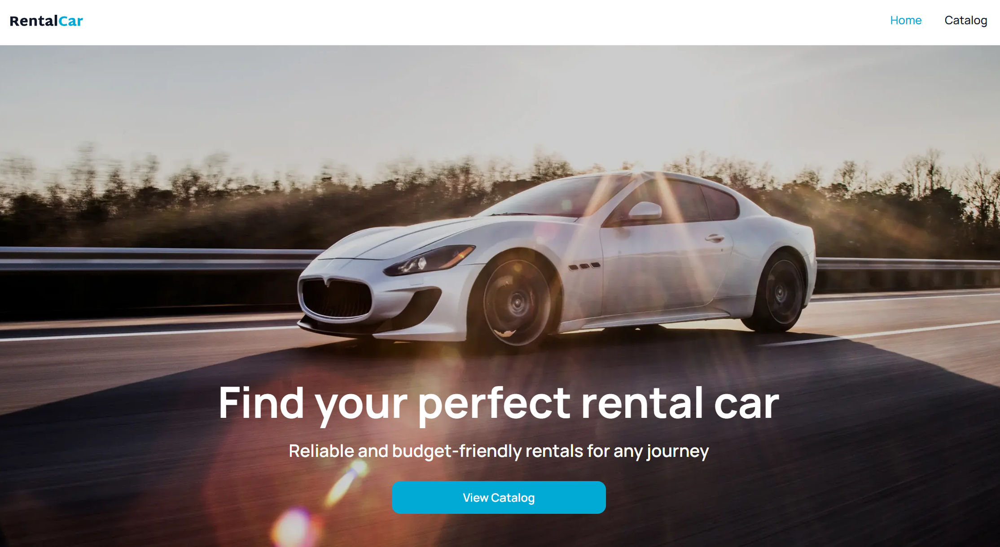
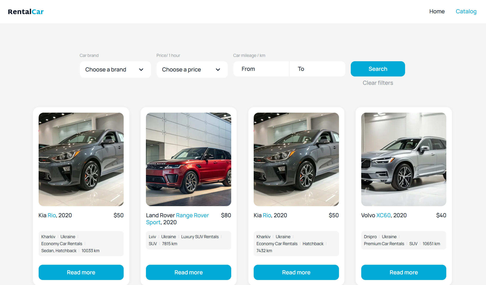
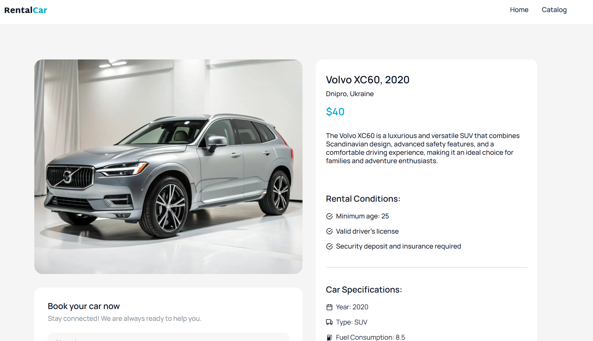

# 🚗 RentalCar

A modern car rental web application built with React and TypeScript that allows users to browse available vehicles, filter them by multiple criteria, view detailed information.

The project demonstrates modern frontend development practices, including server state management, asynchronous data fetching, reusable components.

---

## 🌐 Live Demo

🔗 https://rental-car-smoky-seven.vercel.app/

---

## ✨ Features

- 🚘 Browse a catalog of rental cars
- 🔍 Filter cars by:
  - Brand
  - Rental price
  - Mileage range
- ♾️ Infinite loading using TanStack Query
- 📄 View detailed information about each car
- ⚡ Fast server-state management with React Query
- 📱 Fully responsive design
- ⏳ Loading and error handling for API requests

---

## 🛠️ Tech Stack

### Frontend

- React
- TypeScript
- Vite
- React Router
- CSS Modules

### Data Fetching

- TanStack Query (React Query)
- Axios

### UI Libraries

- React Select
- React Icons
- React Spinners
- Swiper
- SimpleLightbox
- iziToast

## 🎯 Learning Goals

This project demonstrates practical experience with:

- React
- TypeScript
- React Router
- TanStack Query
- useInfiniteQuery
- Axios
- REST API integration
- Server state management
- Custom React Hooks
- Filtering and searching
- Infinite scrolling
- Component-based architecture
- Error handling
- Loading states
- Reusable components

---

## 🔍 Main Functionality

### Car Catalog

Browse a collection of rental cars with smooth infinite loading powered by TanStack Query.

### Advanced Filtering

Filter cars by:

- Brand
- Rental price
- Mileage range

### Car Details

View detailed information about each vehicle, including specifications and rental information.

---

## 📡 API

The application consumes a REST API to retrieve:

- Available cars
- Car details
- Available brands

Data is fetched using **Axios** and managed with **TanStack Query**, providing:

- caching
- background refetching
- loading states
- error handling
- infinite queries

---

## 📷 Screenshots

You can add screenshots of:

- Home page
  

- Car catalog
  

- Car details
  
